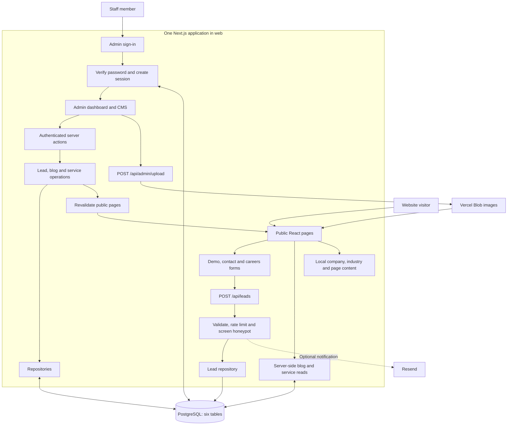
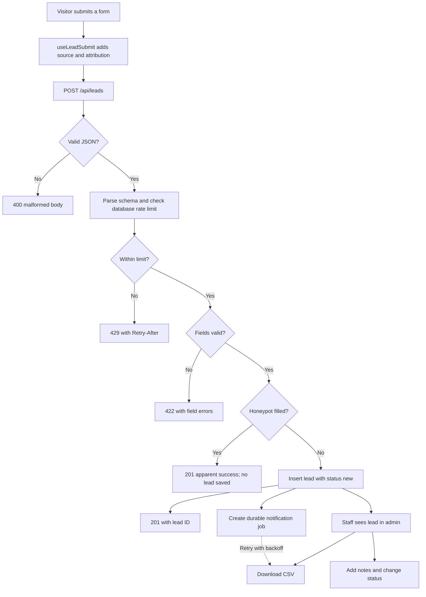
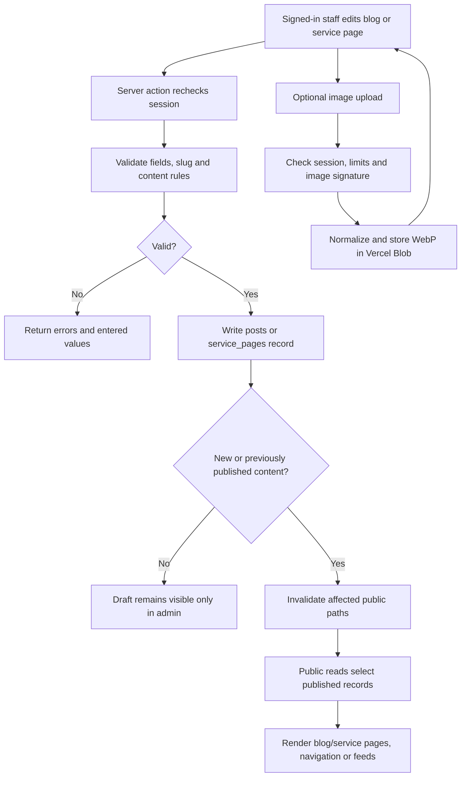

# Nova Pulse: architecture and remaining backend work

Reviewed and implemented 12 September 2026 against the local working tree. This is not confirmation of a deployed website or production Neon database.

**The main finding:** this is a marketing website, enquiry-management system and small content management system in one Next.js application. The production hardening pass now covers permissions, durable notifications, concurrent rate limiting, content aliases, retention and scheduled maintenance.

**Confirmed CMS scope:** Blog and Services only. Their admin editors manage creation, editing, draft/publish status, deletion and associated images. Homepage, About, Industries, Clients, Careers, Contact, Products and legal content remain managed through source files. CMS editors for those areas are outside scope, not unfinished backend work. Lead management remains a separate existing admin function.

The HRMS, payroll, biometric attendance, security and recruitment pages describe services Nova Pulse sells. This repository does not contain an employee HRMS, payroll processing engine, biometric-device ingestion service or applicant-tracking product. Those would be separate product scopes.

## 1. What frontend and backend mean here

The **frontend** is what a visitor or staff member sees: pages, menus, forms, articles, animations and the admin dashboard. It uses React, TypeScript and Tailwind CSS.

The **backend** validates submissions, verifies logins, controls access, reads and writes PostgreSQL, sends notification requests and uploads images. It uses Next.js route handlers and server actions, Drizzle ORM, Zod, bcrypt, signed JWT cookies, Resend and Vercel Blob.

Both are inside `web/`. There is no separate Express, Django or other backend server to start. Next.js serves them as one application. Many frontend components render on the server; “frontend” does not mean every component runs in the browser.

The installed package declarations specify Next.js 16.3.4, React 19.2.8, TypeScript and Tailwind CSS 4. These versions are taken from this repository, not inferred from framework defaults.

## 2. Directory structure

```text
novapulse1/
├── index.html, products.html      Original static site
├── *.png, *.jpg, *.jpeg           Original image assets
├── .github/workflows/ci.yml       Typecheck, lint, tests and build
└── web/                          Current full-stack application
    ├── app/
    │   ├── layout.tsx            Root HTML, metadata, modal and motion providers
    │   ├── globals.css           Tailwind, brand styles, animations
    │   ├── (site)/               Shared marketing layout; parentheses are not in URLs
    │   │   ├── page.tsx          Homepage
    │   │   ├── services/         Listing and [slug] service pages
    │   │   ├── industries/       Listing and [slug] industry pages
    │   │   ├── blog/             Listing, [slug] article, feed.xml
    │   │   ├── about/, contact/, clients/, careers/
    │   │   └── privacy-policy/, terms-conditions/
    │   ├── products/page.tsx     Separate product page with its own visual layout
    │   ├── admin/
    │   │   ├── login/            Sign-in page
    │   │   └── (protected)/      Session-guarded admin layout
    │   │       ├── page.tsx      Lead dashboard
    │   │       ├── leads/[id]/   Lead details, notes and status
    │   │       ├── export/       CSV download route
    │   │       ├── blog/         List, create and edit posts
    │   │       └── services/     List, create and edit service pages
    │   ├── api/leads/route.ts    Public enquiry endpoint
    │   ├── api/admin/upload/    Authenticated image upload endpoint
    │   └── sitemap.ts, robots.ts, manifest.ts, opengraph-image.tsx
    ├── components/
    │   ├── sections/            Homepage sections
    │   ├── admin/               Staff forms, tables, filters and editors
    │   ├── illustrations/       Original SVG scenes
    │   ├── motion/, ui/         Reveal animations, counters, reusable controls
    │   ├── tools/               Browser payroll-effort estimator
    │   └── site-header, site-footer, demo-modal, lead-form, etc.
    ├── content/                 Static company, industry and client data; seed content
    ├── lib/
    │   ├── leads/               Enquiry validation, rules, queries and actions
    │   ├── auth/                Password verification, sessions and guards
    │   ├── blog/                Post queries, editing, Markdown and public reads
    │   ├── services/            Service-page queries, editing and public reads
    │   ├── db/                  PostgreSQL connection and Drizzle schema
    │   ├── email/               Resend wrapper and enquiry notification template
    │   └── env, rate-limit, attribution, csv, result, site, use-lead-submit
    ├── drizzle/                 Three SQL migrations and schema snapshots
    ├── scripts/                 Migrate database; seed admin, posts and services
    ├── tests/                   Vitest tests
    └── public/images/           Optimized static image assets
```

The root `index.html` still contains a Formspree submission action. The new app uses `/api/leads`. They are separate implementations; which one is live depends on deployment configuration, which was not checked.

## 3. Frontend: pages and data sources

| Area | How it is built | Where the content comes from |
| --- | --- | --- |
| Homepage | Composes 16 section components | Primarily component text and local content modules |
| Services | Shared listing and `[slug]` page template | Published `service_pages` database records; static service fallback on read failure |
| Industries | Shared listing and `[slug]` template | `content/industries.ts`; related services are resolved through the service read module |
| Blog | Listing with tags, article template, reading progress and RSS | Published `posts` records; Markdown body rendering |
| About, clients, careers, contact | Page components and shared UI | Company/client/industry modules, site settings and inline copy |
| Products | Dedicated React page | Content in the page source |
| Admin | Tables, filters, status and note forms, blog/service editors | Server reads from PostgreSQL; writes through server actions |
| Header | Interactive desktop/mobile navigation | Published services passed in by the site layout |
| Footer | Server-rendered links | Published services plus code-managed industry links |

`page.tsx` defines a page, `layout.tsx` wraps related pages, `[slug]` or `[id]` means a variable URL segment, and `route.ts` handles an HTTP request directly. `(site)` and `(protected)` are organizational route groups, not parts of the public URL.

Most content components render on the server. Interactive components use `"use client"`: the header, demo modal, forms, admin editors, counters, accordions, reading progress and the estimator. The README claim that only two components ship browser JavaScript is outdated.

The app mixes prerendering and request-time rendering. Service and article routes enumerate published slugs during the build; admin uses session/request data; the blog listing reads `searchParams` for tag filtering. Do not treat the whole marketing app as guaranteed static or rely on the old fixed “34 pages” count.

Only blog and service content have CMS editors, matching the confirmed scope. Company details, industries, testimonials, vacancies, homepage sections and product content are intentionally managed through source edits. The empty leadership and vacancy arrays are intentional content gaps, not failed database features.

## 4. Backend: implemented modules

The main pattern is:

```text
HTTP route / server action
        → validation and service rules
        → repository queries
        → Drizzle database connection
        → PostgreSQL
```

`validation.ts` describes accepted data. `service.ts` handles domain operations. `repository.ts` issues database queries. `actions.ts` connects admin forms to server operations. Public `index.ts` modules adapt database records into the shape the pages render. This layering is useful, although auth queries live directly in auth modules and some lead service operations simply re-export repository functions.

| Module | Implemented behavior | Main source |
| --- | --- | --- |
| Lead capture | Name, email, phone, company, service, message, source and campaign fields; validation; honeypot; per-IP limit; persistence | [Lead service](web/lib/leads/service.ts) |
| Lead management | Search name/email/company/phone; status filtering; 25-row pagination; status counts; detail view; notes; status changes | [Lead repository](web/lib/leads/repository.ts) |
| CSV export | Authenticated download, newest 5,000 leads, CSV escaping and spreadsheet-formula defense | [Export route](web/app/admin/(protected)/export/route.ts), [CSV utility](web/lib/csv.ts) |
| Authentication | bcrypt passwords; sign-in/out; 8-hour signed JWT session cookie; database user lookup; login rate limit | [Auth actions](web/lib/auth/actions.ts), [Sessions](web/lib/auth/session.ts) |
| Blog CMS | Create, edit, delete, draft/publish/unpublish, slugs, tags, author, cover metadata, publication date and revalidation | [Blog service](web/lib/blog/service.ts) |
| Service CMS | Create, edit, delete, draft/publish/unpublish, page sections, FAQs, stats, images, sort order, related services and revalidation | [Service service](web/lib/services/service.ts) |
| Image uploads | Sign-in check; JPG/PNG/WebP signature checks; size checks; generated filenames; upload rate limit; Vercel Blob storage | [Upload route](web/app/api/admin/upload/route.ts) |
| Email | Optional sales notification with enquiry details and admin link | [Email wrapper](web/lib/email/client.ts) |
| Database setup | Schema migrations; admin provisioning; import of blog and service seed content | [Scripts](web/scripts) |

There are only two custom POST API routes: `/api/leads` and `/api/admin/upload`. Most admin writes do not need a separately named REST endpoint: Next.js server actions receive those form submissions. The CSV endpoint is `/admin/export`, not `/api/admin/export`.

## 5. Database structure

[The schema](web/lib/db/schema.ts) defines eight application tables:

| Table | Stores | Relationships |
| --- | --- | --- |
| `users` | Staff identity, password hash, `admin`/`viewer` role | Authors notes and creates/updates CMS records |
| `leads` | Enquiry details, pipeline status, timestamps, attribution, hashed IP and user agent | One lead has many notes |
| `lead_notes` | Note text, author ID/name and timestamp | Lead deletion cascades to notes; user deletion preserves the name and clears author ID |
| `rate_limit_hits` | Bucket identifiers and attempt timestamps | Supports lead, login and upload limits |
| `posts` | Markdown, metadata, draft/published status and authoring timestamps | Creator/updater IDs reference users |
| `service_pages` | Page copy, images, structured JSON sections, related slugs and status | Creator/updater IDs reference users; related slugs are application-validated text, not foreign keys |
| `notification_jobs` | Durable lead-email delivery attempts, locks and retry timing | One job per lead; lead deletion cascades to its job |
| `media_assets` | Admin-uploaded Blob assets and ownership metadata | Content writes validate referenced Blob URLs; maintenance removes stale unused assets |

Lead status values are `new`, `contacted`, `qualified`, `won` and `lost`. The UI permits selecting a status; it does not enforce a fixed sequence or record a complete status-change history.

Migrations are `0000_init.sql` for the original lead/auth tables, `0001_content.sql` for blog posts and `0002_services.sql` for editable services. Migration files existing locally does not prove they have been applied to a deployed database.

## 6. Flowcharts

The overall architecture:



The enquiry flow:



The CMS publishing flow:



The diagrams show intended successful paths. Database failures can still throw outside the application's structured error responses. The current session checks also do not enforce the `admin` versus `viewer` distinction.

## 7. Production controls implemented

- JSON-LD uses safe serialization, roles are enforced at all CMS, upload and lead-mutation boundaries, and blank optional environment values normalize to `undefined`.
- Neon uses a pooled runtime connection and a direct migration connection. The runtime disables prepared statements for transaction pooling and uses verified TLS for Neon hosts.
- Content writes serialize conflicting changes, preserve old slugs as redirects, update related services transactionally and prevent deletion while references remain.
- Lead creation atomically creates a notification job. Resend failures are persisted for exponential retry without losing the lead.
- The rate limiter takes a PostgreSQL advisory lock per bucket. The public lead route limits malformed submissions too and returns controlled database errors.
- A daily Vercel cron removes expired noncustomer leads, prunes rate-limit rows, retries notifications and deletes unreferenced uploads after a grace period.
- Cover uploads decode and normalize still images, limit request size to Vercel-safe 4 MB, track Blob assets and validate CMS references.
- Campaign attribution is captured on arrival and retained as first-touch attribution. CSV exports apply the dashboard status and search filters.

### Optional product expansion, not missing core infrastructure

No account-management UI, password-reset flow, MFA, lead assignment, follow-up reminders, duplicate-lead handling, status audit log, scheduled publishing or content revision history is present. These are observations about possible future capabilities, not requirements for the confirmed Blog-and-Services CMS scope. A careers CMS or application-management system is outside scope.

The careers form currently creates an ordinary lead marked with `source = careers-page`; CVs are requested later by email. The estimator is a browser calculation. WhatsApp controls open WhatsApp links; there is no WhatsApp messaging backend. These are current scope choices, not broken integrations.

## 8. Configuration and deployment work

The local `.env.local` has nonempty `DATABASE_URL` and `AUTH_SECRET`. Resend settings and the Blob token are missing or blank. This review checked only presence, did not expose values, and did not establish whether the database is reachable or migrations/admin/content are present.

For the intended deployment, verify:

1. The host builds `web/` as the Next.js application.
2. Neon runtime (`DATABASE_URL`) and direct migration (`DIRECT_DATABASE_URL`) settings are valid.
3. All three migrations are applied to the intended database.
4. An admin account exists and initial blog/service content is imported using `db:seed-content`.
5. Resend settings and image storage are configured if those features are required.
6. Login, lead submission, CMS publishing, uploaded images and CSV downloads work on the deployment.
7. Database backup/restore, error reporting and scheduled maintenance are configured. These may exist outside the repository; they were not verified here.

Seeding services matters: a reachable, empty `service_pages` table returns an empty list, not the static fallback. Merely applying migrations can therefore remove the service menu until content is seeded/published.

There are many pre-existing modified and untracked files, including CMS modules and migrations. Review and include the complete intended changes before release. This report does not establish that those files have been committed, pushed or deployed.

## 9. Verification performed

| Check | Result |
| --- | --- |
| `npm run typecheck` | Passed |
| `npm run lint` | Passed |
| Vitest integration suite against isolated PostgreSQL | 113 passed across 11 files |
| `npm run typecheck` | Passed |
| `npm run lint` | Passed |
| Production build | Passed; 35 static pages generated |
| Production dependency audit | Passed; 0 vulnerabilities |
| Production deployment and live Neon verification | Not run: no production credentials or deployment request supplied |

Tests use a local database whose name must end in `_test`; the setup migrates and truncates it before the suite. No production database records were changed. Browser verification builds the application and covers public pages, lead capture, Blog and Services CMS lifecycles, redirects and role boundaries.
